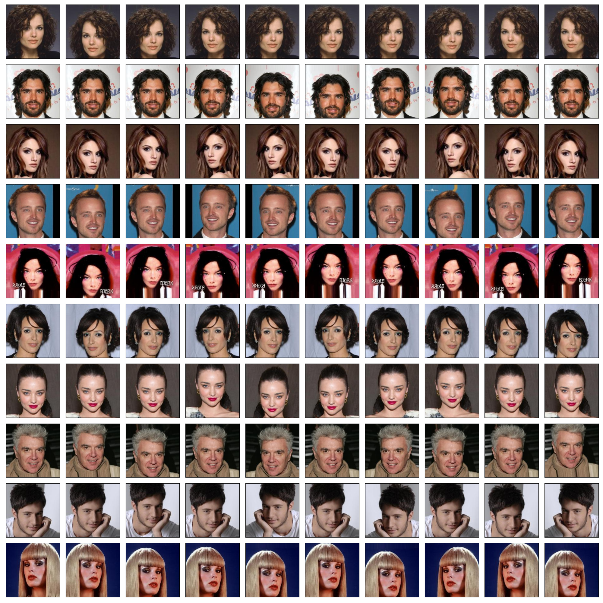

# NOTE

Here, we describe memorandom for reproducing the original implementation and experimental results.

---
## 1. CelebA Dataset and Data Augmentation

### Fukui's original augmentation
Fukui's original implementation does not uses any data augmentation.
He firstly resize an image to (224, 224), which ignore to keep aspect ratio (original image size is 178 x 218).
Then, he only applies normalization of RGB values.

### Mitsuhara's implementation
He uses RandomResizedCrop, RandomHorizontalFlip, ToTensor, and Normalize.
The most problem is RandomResizedCrop with default values, which sometimes crop very small region.
This is the most different modification from Fukui's implementation from the viewpoint of dataset settings.

### About RandomResizedCrop
torchvision.transforms.RandomResizedCrop() randomly crop images.
The default scale is (0.08, 1.0) and the default ratio is (0.75, 1.3333333333333333).
Therefore, sometimes it crops very small regions.

### Appropriate parametes of data augmentation (if needed)

For training images, I recommend to use the following transforms and the parameters:

```python
trans_train = transforms.Compose([
    transforms.Resize(size=(224, 224)),
    transforms.RandomResizedCrop(224, scale=(0.8, 1.0), ratio=(1.0, 1.0)),
    transforms.RandomHorizontalFlip(),
    transforms.ColorJitter(brightness=0.5, contrast=0.5, saturation=0.5, hue=0.05),
    transforms.ToTensor(),
    transforms.Normalize(mean=CELEBA_TRAIN_RGB_MEAN, std=CELEBA_TRAIN_RGB_STD)
])
```

For validation and test images, I recommend to use the following transforms:

```python
trans_val = transforms.Compose([
    transforms.Resize(size=(224, 224)),
    transforms.ToTensor(),
    transforms.Normalize(mean=CELEBA_TRAIN_RGB_MEAN, std=CELEBA_TRAIN_RGB_STD)
])
```

### Examples of data augmentation

We show some examples of the `torchvision.transforms`.
The overviewed settings of each example is as follows:

    celeba_dataloader_check_001: default settings of Mitsuhara (no chages for scale and ratio)
    celeba_dataloader_check_002: only fix ratio with (1.0, 1.0)
    celeba_dataloader_check_003: only fix scale with (0.8, 1.0)
    celeba_dataloader_check_004: fix scale with (0.8, 1.0) and ratio with (1.0, 1.0)
    celeba_dataloader_check_005: add ColorJitter to 004
    celeba_dataloader_check_006: adjust params. from 005 settings

For more detailed settings, please check below in `./mtabn/datasets/celeba.py`.





---
## 2. Network Models

### Fukui's implementation ([ABN_CelebA](https://github.com/machine-perception-robotics-group/ABN_CelebA))
* There is NO residual attetntion.
* There is NO sigmoid function before calculating an attention map.
* The number of out_channels of output layers in the perception branch is 2.
    * The loss function for attention branch is BinaryCrossEntropy (Chainer impl.) / BCELossWithLogits (PyTorch impl.).
    * The loss function for perception branch is SoftmaxCrossEntropy (Chainer impl.) / CrossEntropyLoss (PyTorch impl.).

### Mitsuhara's implementation([ABN_CelebA_PyTorch tag:v0.1](https://github.com/machine-perception-robotics-group/MultitaskABN/tree/v0.1))
* There is a residual attention.
* There is a sigmoid function before calculating an attention map.
* The number of out_channels of ouput layers in the perception branch is 1.
    * The loss function for both branch is BCELoss (PyTorch impl.).

### The updated implementation

We follow Fukui's original implementation.


---
## 3. Visualization of Attention Maps

### Value range of attention maps
As we mentioned the above, the Fukui's implementation does NOT have sigmoid function before calculating an attention map.
Fortunately (or Unfortunately?), because the value range of the attention map (Chainer impl.) is almost in [-1, 1], the attention maps can be visualized clearly with out any normalization.

However, the value range of the attention map (PyTorch impl.) is almost in [-100, 100].
Therefore, we need to normalize the attention map values.

### Clip the negative value of attention maps
To visualize attention map, Fukui's implementation clip the nevative value as 0 and use only positive values for making heat map like visualization.


---
## 4. Training Parameters

### Fukui's implementation
Fukui's training params. from `train_param.py` are as follows:

```python
EPOCH = 10
BATCH_SIZE = 8
E_BATCH_SIZE = 1

OPT_PARAM = 'MomentumSGD'
TRAIN_RATE = 0.01
LR_STEP = 4
LR_DROP = 0.1
WEIGHT_DECAY = 0.0001
MOMENTUM = 0.9

SEED = 1701
```

### Mitsuhara's implementation
Mitsuhara's training params. from README and arg_parser are as follows:

```bash
python3 main.py -a resnet101 --data CelebA
    --epochs 10
    --schedule 5 7 (--gamma 0.1)
    --train_batch 32
    --lr 0.01
    --momentum 0.9
    --weight_decay 1e-4
```
