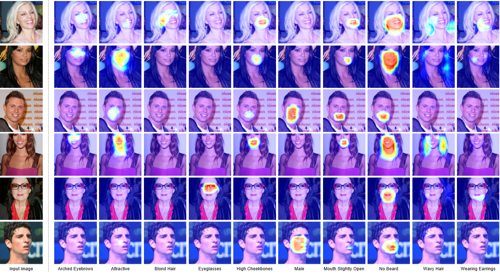

# Attention Branch Network for Multitask Learning with PyTorch

Writer : Masahiro Mitsuhara

Maintainer: [Tsubasa Hirakawa](https://thirakawa.github.io)

## 1. Overview
This repository is PyTorch implementation of Attention Branch Network for Multitask Learning.

In this repository, we use attribute classification task on [CelebA dataset](https://mmlab.ie.cuhk.edu.hk/projects/CelebA.html).

Please note that the model structure is different from the [original Chainer implementation](https://github.com/machine-perception-robotics-group/ABN_CelebA) because we conducted further experiments and we seek better models by PyTorch.
If you want to use or re-produce the original ABN paper at CVPR, please use [the original Chainer implementation](https://github.com/machine-perception-robotics-group/ABN_CelebA).



### Change Log
* 09 Jun 2019: (different repository) The first release of Multitask ABN implemented by Chainer. You can find [here](https://github.com/machine-perception-robotics-group/ABN_CelebA).
* 11 Dec 2020: (this repository) Implement MultitaskABN with PyTorch. We also improve the network architecture from the original Chainer implementation to achieve better results. You can find at [tag:v0.1](https://github.com/machine-perception-robotics-group/MultitaskABN/tree/v0.1).
* xx Jul 2022: (this repository) Updated PyTorch implementation for newer PyTorch version (torch 1.11.0).

### Citation
If you find this repository is useful, please cite the following reference.

```bibtex
@inproceedings{fukui2018,
  author = {Hiroshi Fukui and Tsubasa Hirakawa and Takayoshi Yamashita and Hironobu Fujiyoshi},
  title = {Attention Branch Network: Learning of Attention Mechanism for Visual Explanation},
  booktitle = {Computer Vision and Pattern Recognition},
  year = {2019},
  pages = {10705-10714}
}
```
```bibtex
@article{fukui2018,
  author = {Hiroshi Fukui and Tsubasa Hirakawa and Takayoshi Yamashita and Hironobu Fujiyoshi},  
  title = {Attention Branch Network: Learning of Attention Mechanism for Visual Explanation},  
  journal = {arXiv preprint arXiv:1812.10025},
  year = {2018}
}
```

You can find our papers as follows:
* [CVPR paper](http://openaccess.thecvf.com/content_CVPR_2019/html/Fukui_Attention_Branch_Network_Learning_of_Attention_Mechanism_for_Visual_Explanation_CVPR_2019_paper.html)
* [ArXiv paper](https://arxiv.org/abs/1812.10025)

---
## 2. Preparation

### Developed environment and Docker

Please see `docker/README.md`.

### Dataset

Please see `data/README.md`.

---
## 3. Execution

Please see `script_local` directory.

### Model selection (training)

We can choose network models as follows:

* `--model [model name]`: network model. Please choose one from the following options.
  * ResNet: `resnet18`, `resnet34`, `resnet50`, `resnet101`, `resnet152`
  * Multitask ABN (V1): `mtabn_v1_resnet18`, `mtabn_v1_resnet34`, `mtabn_v1_resnet50`, `mtabn_v1_resnet101`, `mtabn_v1_resnet152`
  * Multitask ABN (V2): `mtabn_v2_resnet18`, `mtabn_v2_resnet34`, `mtabn_v2_resnet50`, `mtabn_v2_resnet101`, `mtabn_v2_resnet152`
* `--pretrained`: use pretrained model parameters by ImageNet as an intial parameter.
* `--residual_attention` (ABN only): use residual attention mechanism. The differences are as follows:
  * No residual attention: $f_c'(x_i) = M(x_i) \cdot g_c(x_i)$
  * Residual attention: $f_c'(x_i) = (1 + M(x_i)) \cdot g_c(x_i)$

---
## 4. Pre-trained model

TBA

---
## 5. Related Links

### Web Pages

#### English

* [Machine Perception & Robotics Group](http://mprg.jp/en/)
* [Decision-making Analysis by Attention Mechanism and Applications (MPRG Tutorial)](http://mprg.jp/en/research/abn_e)

#### Japanese

* [Machine Perception & Robotics Group](http://mprg.jp/)
* [Decision-making Analysis by Attention Mechanism and Applications (MPRG Tutorial)](http://mprg.jp/research/abn_j)

### GitHub repositories

* [ABN for image classification](https://github.com/machine-perception-robotics-group/attention_branch_network)
* [Spatio-Temporal ABN](https://github.com/mprg-smilab/SpatioTemporalAttentionBranchNetwork)
