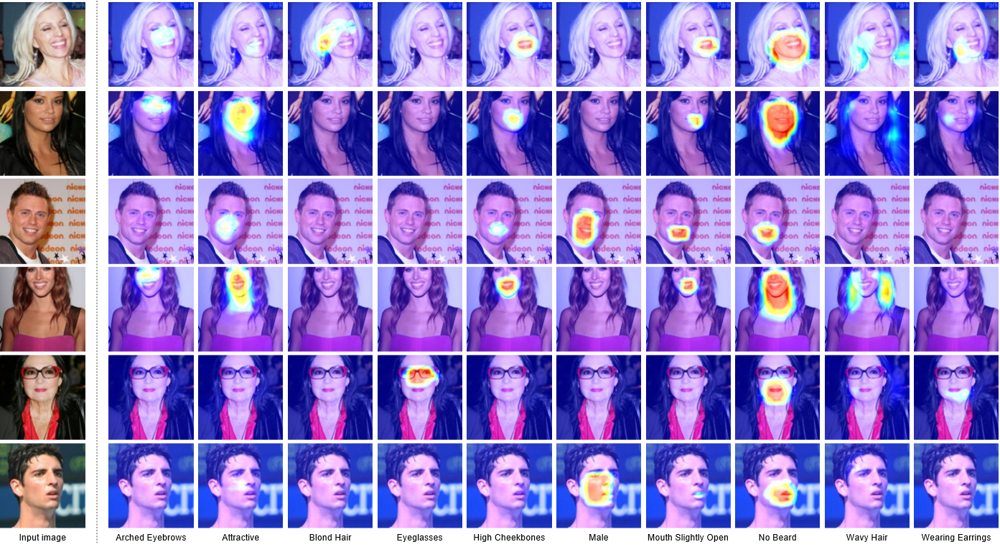

# Attention Branch Network for CelebA implemented by PyTorch
Writer : Masahiro Mitsuhara

Maintainer: [Tsubasa Hirakawa](https://thirakawa.github.io)

## Abstract
This repository is PyTorch implementation of Attention Branch Network for CelebA (original implementation is Chainer).
Please note that the model structure is different from the [Chainer implementation version](https://github.com/machine-perception-robotics-group/ABN_CelebA) because we conducted further experiments and we implemented obtained better model by PyTorch.
If you want to use or re-produce the paper, please refer to the [Chainer implementation version](https://github.com/machine-perception-robotics-group/ABN_CelebA).

<!-- このリポジトリは，CelebAによるAttention Branch NetworkのChainer実装をpytorch実装で再現したものです．-->
<!--こちらは，実験を重ねてpytorchで再実装したものなので，モデル構造がChainer実装版と異なることに注意してください．-->
<!--論文を再現したい場合はChainer実装版を参照してください．-->


Detail of ABN is as follows:
[CVPR paper, ](http://openaccess.thecvf.com/content_CVPR_2019/html/Fukui_Attention_Branch_Network_Learning_of_Attention_Mechanism_for_Visual_Explanation_CVPR_2019_paper.html)
[ArXiv paper, ](https://arxiv.org/abs/1812.10025)
and, 
[ABN for image classification](https://github.com/machine-perception-robotics-group/attention_branch_network)

## Enviroment
Our source code is based on [https://github.com/machine-perception-robotics-group/attention_branch_network](https://github.com/machine-perception-robotics-group/attention_branch_network) implemented with PyTorch.

We confirmed the following environments:

### Prepare environment by yourselves
Requirements of PyTorch version are as follows:
<!--我々のソースコードは，最新のPyTorchのバージョンに対応しています．-->
- PyTorch : 1.1.0+
- torchvision : 0.3.0+

### Docker
We prepared Docker environments. You quickly start to use Docker and run scripts.
For more details, please see [docker/README.md](https://github.com/machine-perception-robotics-group/attention_branch_network/blob/master/docker/README.md), which is the same as [Attention Branch Network](https://github.com/machine-perception-robotics-group/attention_branch_network/tree/master/docker).

PyTorch version of this docker environments are as follows (Please note the versions of PyTorch and torchvision):
<!--このDocker環境は，[Attention Branch Network](https://github.com/machine-perception-robotics-group/attention_branch_network/tree/master/docker)のGitHubと同様のDocker環境です．-->
<!--Pytorchとtorchvisionのバージョンに注視してください．-->
- PyTorch : 0.4.0
- torchvision : 0.2.1

## Execution
Example of run command is as follows:

#### Training
```bash
python3 main.py -a resnet101 --data CelebA --epochs 10 --schedule 5 7 --gamma 0.1 -c checkpoints/celeba/resnet101 --gpu-id 0,1 --test-batch 20
```

#### Evaluation
```bash
python3 main.py -a resnet101 --data CelebA --epochs 10 --schedule 5 7 --gamma 0.1 -c checkpoints/celeba/resnet101 --gpu-id 0,1 --test-batch 20 -e --resume checkpoints/celeba/resnet101/model_best.pth.tar
```

If you want to visualize the attention map at the time of evaluation, add ```-s``` and execute.

<!--評価時にAttention mapを可視化する場合は，```-s```をつけて実行してください．-->

### Examples of attention map


## Citation

```
@article{fukui2018,
	author = {Hiroshi Fukui and Tsubasa Hirakawa and Takayoshi Yamashita and Hironobu Fujiyoshi},
	title = {Attention Branch Network: Learning of Attention Mechanism for Visual Explanation},
	journal = {Computer Vision and Pattern Recognition},
	year = {2019},
	pages = {10705-10714}
}
```
```
@article{fukui2018,  
	author = {Hiroshi Fukui and Tsubasa Hirakawa and Takayoshi Yamashita and Hironobu Fujiyoshi},  
	title = {Attention Branch Network: Learning of Attention Mechanism for Visual Explanation},  
	journal = {arXiv preprint arXiv:1812.10025},  
	year = {2018}  
}  
```
